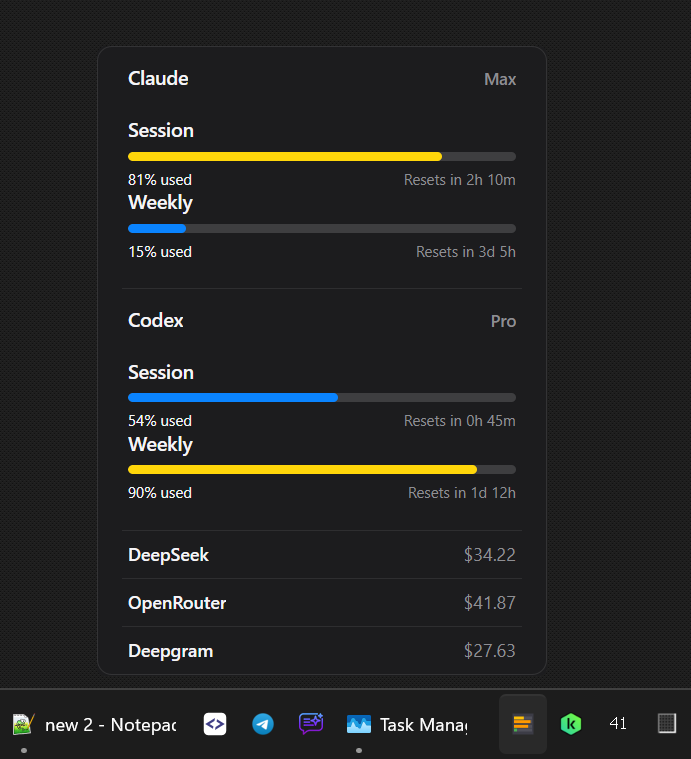
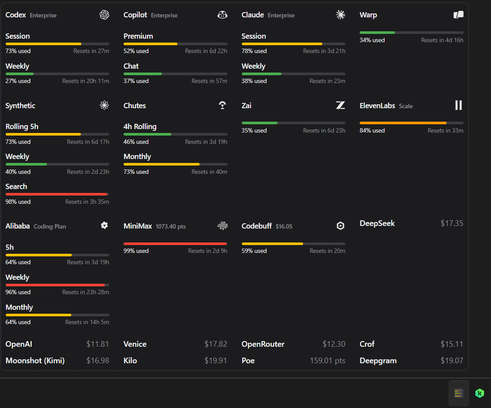

# UsageBar

UsageBar is a minimal Windows notification-area app for showing LLM or API usage and balance information.




<details>
<summary>Multi column</summary>



</details>

---

## Supported LLMs and APIs
- Codex OAuth
- Claude OAuth
- Antigravity OAuth
- Command Code API
- ElevenLabs API
- DeepSeek API
- OpenRouter API
- ZenMux API
- Moonshot (Kimi) API
- Deepgram API
- Kilo AI API

*The providers below are not tested yet:*

- OpenAI API
- Venice API
- Copilot API
- Crof API
- Codebuff API
- Warp API
- Zai API
- Synthetic API
- Chutes API
- MiniMax API
- Poe API
- Alibaba API

## Features

- **Refresh token** — automatically refreshes supported OAuth credentials when they expire.
- **Warm Window** — optionally sends a minimal request to Codex, Claude, and Antigravity after a session reset. Models are discovered dynamically and selected with the shared Small Model Selector preference.

## Install

1. Download the latest release for your platform from [Releases](https://github.com/bariskisir/usagebar/releases/latest).
2. Install or extract the package.
3. Run **Usage Bar**.

## Configuration

Right-click the tray icon and select **Settings** to open the settings panel.


## Notifications

Notifications are sent when a usage window crosses a threshold (defaults: 70% high, 90% critical) or resets. Supported channels:

- **Telegram** — set `notification.telegram.token` and `notification.telegram.chatId`, toggle `enabled`
- **Discord** — set `notification.discord.webhookUrl`, toggle `enabled`


## Development

```bash
git clone https://github.com/bariskisir/usagebar.git
cd usagebar
dotnet run --project src/UsageBar.App
```

## License

MIT — see [LICENSE](LICENSE).
