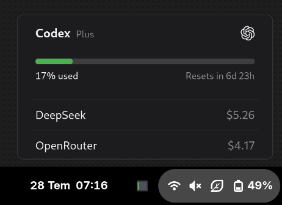

<p align="center">
  
</p>

<h1 align="center">🚨 UsageBar is Deprecated 🚨</h1>

<h3 align="center">This project is no longer maintained and will not receive further updates, bug fixes, or new features.</h3>

<p align="center">
  <strong>👉 Please migrate to its successor:</strong>
</p>

<p align="center">
  <a href="https://github.com/bariskisir/sessionlens">
    
  </a>
</p>

<p align="center">
  <a href="https://github.com/bariskisir/sessionlens"><strong>https://github.com/bariskisir/sessionlens</strong></a>
</p>

---

# UsageBar

UsageBar is a minimal Windows and Linux tray app for showing LLM or API usage and balance information.


<details>
<summary>Multi column</summary>


</details>

<details>
<summary>Linux</summary>



</details>

---

## Supported LLMs and APIs
- Codex OAuth
- Claude OAuth
- Antigravity OAuth
- Command Code API
- ElevenLabs API
- DeepSeek API
- OpenRouter API
- ZenMux API
- Moonshot (Kimi) API
- Deepgram API
- Kilo AI API

*The providers below are not tested yet:*

- OpenAI API
- Venice API
- Copilot API
- Crof API
- Codebuff API
- Warp API
- Zai API
- Synthetic API
- Chutes API
- MiniMax API
- Poe API
- Alibaba API

## Features

- **Refresh token** — automatically refreshes supported OAuth credentials when they expire.
- **Warm Window** — optionally sends a minimal request to Codex, Claude, and Antigravity after a session reset. Models are discovered dynamically and selected with the shared Small Model Selector preference.

## Install

### Windows

Download the x64 or ARM64 installer for your device from
[Releases](https://github.com/bariskisir/usagebar/releases/latest). Run the installer, then launch
**Usage Bar** from the Start menu. Windows release files use the
`UsageBar-<version>_<architecture>-setup.exe` naming format.

### Linux

Download the x86_64 or ARM64 AppImage for your device from
[Releases](https://github.com/bariskisir/usagebar/releases/latest). Linux release files use the
`UsageBar-<version>_<architecture>.AppImage` naming format. Mark the AppImage as executable if
necessary, then launch it directly; no extraction or installation is required. The .NET runtime is
included, while GTK 3 and WebKitGTK 4.1 remain native system dependencies and must be available on
the host.

#### GNOME

GNOME does not provide a StatusNotifier/AppIndicator tray host by default. To display UsageBar beside
the clock, GNOME users need an AppIndicator-compatible Shell extension, such as **AppIndicator and
KStatusNotifierItem Support**, enabled for the current user. The exact extension or package name
depends on the distribution.

1. Find **AppIndicator and KStatusNotifierItem Support** in the distribution's software center,
   package manager, or GNOME extension manager, then enable it.
2. Log out and log back in so GNOME Shell loads the extension.
3. Launch the UsageBar AppImage again. Logging back in loads the extension but does not automatically
   restart UsageBar.

The UsageBar icon should now appear in the top panel. If UsageBar still reports that no tray host was
detected, confirm that the extension is enabled in the GNOME **Extensions** application, then close
and relaunch the AppImage.

Desktops that already provide a StatusNotifier host do not need the GNOME extension. Without any
tray host, UsageBar displays a small fallback window so its actions remain accessible.

#### Start automatically (optional)

An AppImage is portable and does not add itself to the application menu or login startup. Move it out
of `Downloads` to a location that will not change, for example `~/.local/bin/usagebar`, and make sure
it remains executable. To start UsageBar after each login, create
`~/.config/autostart/usagebar.desktop` with the following content, replacing `<username>` with the
Linux account name:

```ini
[Desktop Entry]
Type=Application
Name=UsageBar
Comment=LLM and API usage in the system tray
Exec=/home/<username>/.local/bin/usagebar
Terminal=false
X-GNOME-Autostart-enabled=true
```

The next login will start UsageBar automatically. The AppIndicator extension must still be installed
and enabled on GNOME for its tray icon to be visible.

## Configuration

Right-click the tray icon and select **Settings** to open the settings panel.


## Notifications

Notifications are sent when a usage window crosses a threshold (defaults: 70% high, 90% critical) or resets. Supported channels:

- **Telegram** — set `notification.telegram.token` and `notification.telegram.chatId`, toggle `enabled`
- **Discord** — set `notification.discord.webhookUrl`, toggle `enabled`


## Development

Clone the repository, then run the project for your platform.

### Windows

```bash
git clone https://github.com/bariskisir/usagebar.git
cd usagebar
dotnet run --project src/UsageBar.Windows
```

### Linux

```bash
git clone https://github.com/bariskisir/usagebar.git
cd usagebar
dotnet run --project src/UsageBar.Linux
```

## License

MIT — see [LICENSE](LICENSE).
